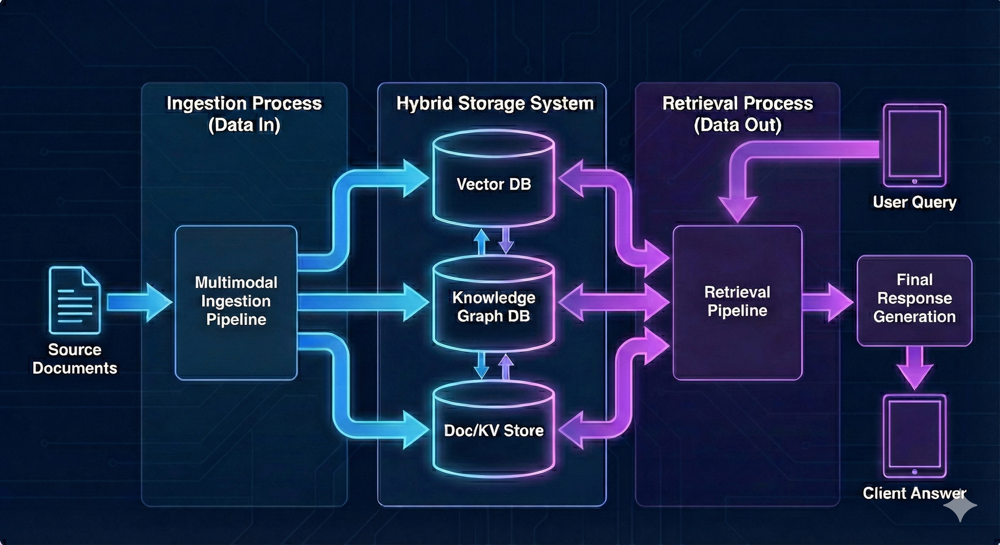
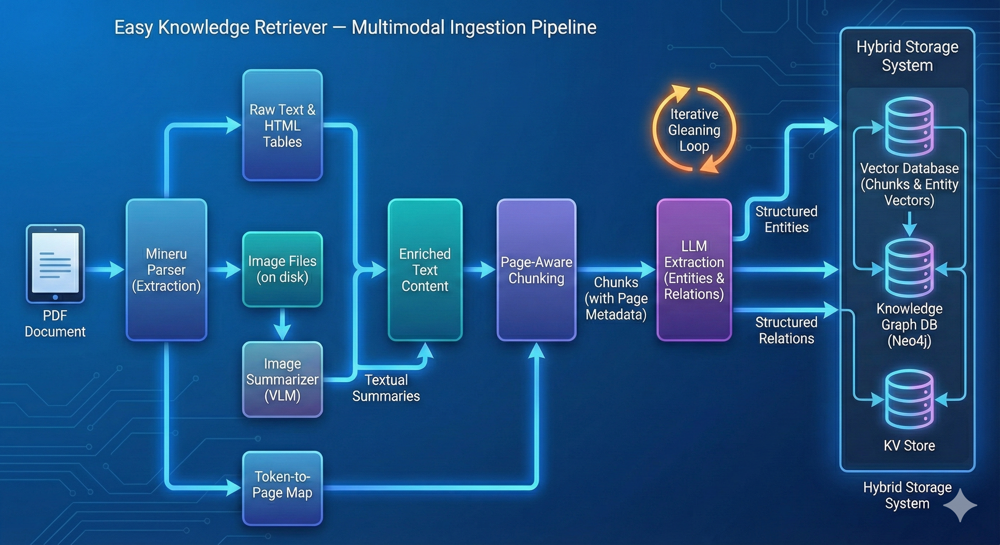
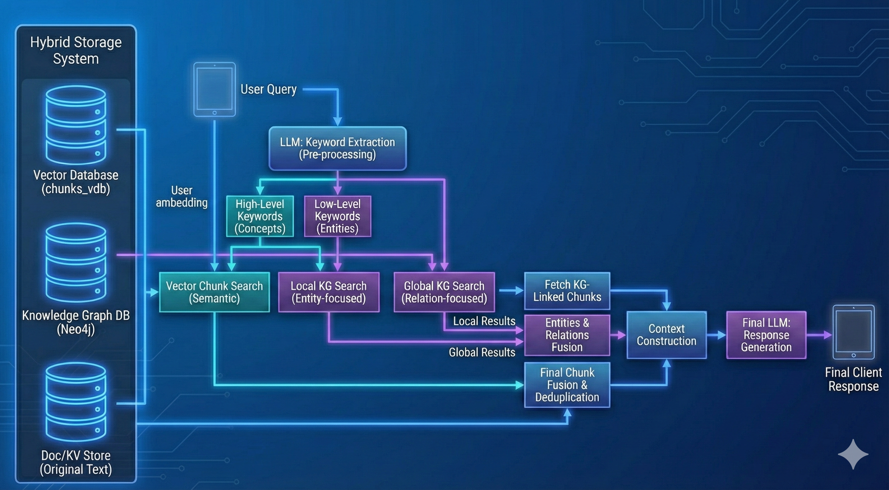

<div align="center">

</div>

<div align="center">
    <h1>Easy Knowledge Retriever</h1>
    <p><b>RAG over your own documents, with a knowledge graph, in a few lines of Python.</b></p>
</div>

[](https://pypi.org/project/easy-knowledge-retriever/) [](https://pypi.org/project/easy-knowledge-retriever/) [](https://creativecommons.org/licenses/by-nc-sa/4.0/) [](https://hankerspace.github.io/EasyKnowledgeRetriever/)

**Easy Knowledge Retriever** (EKR) ingests your documents (PDF, text, Markdown). It builds a knowledge base that combines vector embeddings, a BM25 index and a knowledge graph of entities and relations. It then answers questions with an LLM, citing the source passage and its page.

- **PDF ingestion with MinerU**: layout, tables and images, with page numbers kept for citations
- **Seven retrieval strategies**, from plain vector search to dense + BM25 + knowledge graph (`hybrid_mix`)
- **Cross-encoder reranking** through any OpenAI-compatible `/rerank` endpoint
- **Grounded answers**: the prompts cite the source chunk and page, and refuse questions the corpus does not cover
- **Modular storage**: JSON, NanoVectorDB, NetworkX, Neo4j, Milvus, PostgreSQL
- **LLM agnostic**: any OpenAI-compatible API (OpenAI, Gemini, vLLM, GPUStack, LiteLLM…), async-first

> **Want a user interface?** [**EasyKnowledgeRetriever-Webapp**](https://github.com/hankerspace/EasyKnowledgeRetriever-Webapp) is a ready-to-run web app built on this library. It offers chat with cited sources, document management, a knowledge-graph explorer, an English/French UI and a Docker image.



## Table of contents

- [What's new in 1.4.0](#whats-new-in-140)
- [Installation](#installation)
- [Quick start](#quick-start)
- [Choosing a retrieval strategy](#choosing-a-retrieval-strategy)
- [How it works](#how-it-works)
- [Configuration](#configuration)
- [Web app](#web-app)
- [Development](#development)
- [Evaluation](#evaluation)
- [References](#references) · [License](#license)

## What's new in 1.4.0

This release focuses on answer quality and retrieval speed. The changes were driven by a 51-question benchmark on a long regulatory PDF (see [Choosing a retrieval strategy](#choosing-a-retrieval-strategy)).

### Retrieval

- **The reranker really runs.** The OpenAI-compatible reranker call failed on every request, and `hybrid_mix` never reached it; both are fixed. HTTPS is verified with certifi's CA bundle, and transient gateway errors are retried after 0.5–4 s instead of 4–60 s.
- **Faster, more precise `hybrid_mix`.** Median latency on the benchmark dropped from 22 s to 4.7 s:
  - stored chunk vectors are reused instead of being re-embedded on every query;
  - the dense and BM25 hits, plus the chunks that follow them, are reranked in a single pass, and relevance order is kept;
  - the graph token budget is smaller, and the context is tagged text with the question placed after it.
- **Better `naive` with a reranker.** It fetches twice `chunk_top_k` dense candidates and reranks them down. The reranker can then recover a relevant passage that dense search ranked low.
- **Chunk headings.** A chunking function can attach a `heading` to each chunk, such as `Article 6 – Classification rules`. The heading is stored, prepended to the text that is embedded, BM25-indexed and reranked, and shown to the LLM.
- **Graceful rerank outage.** If the reranker fails, retrieval keeps `chunk_top_k` chunks in first-stage order instead of flooding the context with the whole candidate pool.
- **Page numbers and references kept.** `naive` results carry `page_start`, and merging decomposed sub-queries keeps their chunks and references.

### Answers

- **Stricter prompts.** Answers must cite the chunk and its page. They must refuse questions the corpus does not cover, correct false premises, and add no obligation, condition or list item the passages do not state.
- **Concise answers.** The prompts ask for short, direct answers.
- **Scope check.** The user turn asks for an explicit scope check before answering.

### Ingestion

- **Article-aware chunking.** With `split_by_character`, each section keeps its marker (for example `Article`), and chunks keep their page range.
- **Cleaner graph.** Entity name variants are merged, and PDF extraction artefacts are stripped before chunking.
- **No redundant parsing.** A cached MinerU parse is found in any backend sub-directory, so re-ingesting a document does not parse the PDF again.
- **Resilient ingestion.** Transient 5xx errors from the LLM and embedding gateways are retried instead of failing the whole ingestion.

> **Upgrading from 1.3.x:** the API is unchanged and existing indexes keep working. Chunk headings and article-aware chunking only apply to documents you ingest again.

## Installation

The base install is deliberately light. It pulls only what a NetworkX + NanoVectorDB + JSON pipeline needs, and it can ingest `.txt` and `.md` files.

```bash
pip install easy-knowledge-retriever
```

Everything else is an optional extra:

| Extra | Installs | Needed for |
|---|---|---|
| `[pdf]` | mineru, torch, dill, doclayout_yolo | PDF ingestion via MinerU (**several GB**, see note) |
| `[milvus]` | pymilvus | Milvus vector storage |
| `[neo4j]` | neo4j, pipmaster | Neo4j graph storage |
| `[postgres]` | asyncpg | PostgreSQL KV / vector / graph storage |
| `[cjk]` | pypinyin | Chinese pinyin sorting (falls back to plain sort) |
| `[eval]` | ragas, datasets, langchain-openai | The RAGAS harness under `evaluation/` |

```bash
pip install "easy-knowledge-retriever[pdf]"      # typical RAG-over-PDF setup
pip install "easy-knowledge-retriever[pdf,eval]" # + evaluation harness
pip install "easy-knowledge-retriever[all]"      # everything
```

> **Note on `[pdf]`**
>
> - It installs `mineru[core]`, not bare `mineru`, because the default backend refuses to run without the local pipeline dependencies.
> - It needs OpenCV's system libraries (`libgl1`, `libglib2.0-0`, `libxcb1`, `libsm6`, `libxext6`, `libxrender1`), which slim base images omit.
> - It needs a `torch`/`torchvision` pair from the same wheel index.
> - MinerU downloads its layout, OCR and formula models on first use (several GB). Pre-warm them at Docker build time and persist the cache (`HF_HOME`), or the first ingestion stalls on the download.

## Quick start

The script below builds a knowledge base and queries it. It needs an OpenAI-compatible LLM and embedding endpoint. The reranker is optional but strongly recommended.

```python
import asyncio
import os

from easy_knowledge_retriever import EasyKnowledgeRetriever, QueryParam
from easy_knowledge_retriever.llm.service import OpenAILLMService, OpenAIEmbeddingService
from easy_knowledge_retriever.reranker.openai import OpenAIRerankerService
from easy_knowledge_retriever.kg.kv_storage.json_kv_impl import JsonKVStorage
from easy_knowledge_retriever.kg.kv_storage.json_doc_status_impl import JsonDocStatusStorage
from easy_knowledge_retriever.kg.vector_storage.nano_vector_db_impl import NanoVectorDBStorage
from easy_knowledge_retriever.kg.graph_storage.networkx_impl import NetworkXStorage

WORKING_DIR = "./rag_data"


async def main():
    rag = EasyKnowledgeRetriever(
        working_dir=WORKING_DIR,
        llm_service=OpenAILLMService(
            model="gpt-4o-mini",
            base_url="https://api.openai.com/v1",
            api_key=os.environ["OPENAI_API_KEY"],
        ),
        embedding_service=OpenAIEmbeddingService(
            model="text-embedding-3-small",
            base_url="https://api.openai.com/v1",
            api_key=os.environ["OPENAI_API_KEY"],
            embedding_dim=1536,
        ),
        reranker_service=OpenAIRerankerService(
            model="bge-reranker-v2-m3",
            base_url="https://my-gateway.example.com/v1/rerank",  # full /rerank endpoint
            api_key=os.environ["RERANKER_API_KEY"],
        ),
        kv_storage=JsonKVStorage(working_dir=WORKING_DIR),
        vector_storage=NanoVectorDBStorage(working_dir=WORKING_DIR),
        graph_storage=NetworkXStorage(working_dir=WORKING_DIR),
        doc_status_storage=JsonDocStatusStorage(working_dir=WORKING_DIR),
    )

    await rag.initialize_storages()
    try:
        # 1. Ingest: parse, chunk, embed, extract entities and relations
        await rag.ingest("./documents/report.pdf")   # .pdf needs the [pdf] extra
        await rag.ingest("./documents/notes.md")     # .txt / .md / .markdown work out of the box

        # 2. Query
        result = await rag.aquery(
            "What does the report say about forest fires?",
            param=QueryParam(mode="hybrid_mix"),
        )
        print(result.content)       # the answer, ending with a "References" section
        print(result.references)    # the cited sources, as data
    finally:
        await rag.finalize_storages()   # always finalize to persist the state


if __name__ == "__main__":
    asyncio.run(main())
```

- **Querying later.** A later run can skip `ingest()` and query the same `working_dir` directly.
- **Re-ingesting.** Re-ingesting a file reuses its cached parse and does not create duplicates.
- **Page ranges.** To ingest part of a long PDF, use `rag.ingest(path, start_page=0, end_page=10)`.

More complete scripts are in [`example/`](example/): they build a database, analyse it and query it. They read their endpoints and keys from environment variables (`LLM_API_KEY`, `LLM_BASE_URL`, `EMBEDDING_API_KEY`…).

## Choosing a retrieval strategy

Select a strategy by mode name with `QueryParam(mode=...)`; the retriever's reranker is then used automatically. You can also pass a strategy object for fine-grained options.

| Mode | What it searches | Correctness /5 | Hallucinated answers | Correct page cited | Latency p50 / p95 |
|---|---|---|---|---|---|
| **`hybrid_mix`** (recommended) | Dense + BM25 on chunks, knowledge graph, one rerank | 4.75 – 4.92 | 3.9 – 7.8 % | 95.8 % | 4.7 s / 8.4 s |
| `naive` | Dense vectors on chunks + rerank | 4.96 | 3.9 % | 93.8 % | 3.9 s / 7.2 s |
| `mix` | Knowledge graph + dense vectors | 4.84 | 9.8 % | 97.9 % | 6.0 s / 13.3 s |
| `hybrid` | Knowledge graph only (local + global) | 4.71 | 7.8 % | 93.8 % | 5.1 s / 9.1 s |
| `local` | Entities and their direct relations | – | – | – | – |
| `global` | Relations matching high-level themes | – | – | – | – |
| `bypass` | No retrieval, the LLM answers directly | – | – | – | – |

**Benchmark setup:**

- 51 questions on the EU AI Act (a long PDF in French), including 7 trap questions (out of scope or false premise).
- Generator `qwen-3.6-35b-instruct`, reranker `bge-reranker-v2-m3`, `chunk_top_k = 20`.
- Answers graded by an independent judge model.
- The `hybrid_mix` ranges cover three identical runs; run-to-run noise is about ±0.2 in correctness.

**What the benchmark showed:**

- Every mode except `hybrid` (6/7) handled all 7 trap questions.
- `query_decomposition=True` brought no measurable gain and added 1.5 s at the median.
- **`hybrid_mix`** puts the most reference facts in front of the LLM (98.8 %).
- **`naive`** is the fastest and just as accurate on a single-document corpus.
- **The generator model matters as much as the strategy.** On the same context, a weaker instruction follower hallucinated 2.5 to 5 times more often.

To set per-strategy options, pass a strategy object and give it the reranker yourself:

```python
from easy_knowledge_retriever.retrieval import HybridMixRetrieval

retrieval = HybridMixRetrieval(reranker_service=reranker, chunk_top_k=20, rrf_k=60)
result = await rag.aquery("Which AI practices are prohibited?", retrieval=retrieval)
```

Detailed workflows and the full results table are in [docs/RetrievalStrategies.md](docs/RetrievalStrategies.md).

## How it works

### Ingestion



1. **Parsing.** PDFs go through **MinerU**, which extracts text, tables and images with their layout and page numbers. The parse is cached under `working_dir/parsed_docs` and reused. Text and Markdown files are read directly.
2. **Image enrichment.** The LLM describes the extracted images (use a vision-capable model), and the descriptions are indexed with the text.
3. **Chunking.** The text is split into token windows (`chunk_token_size`, `chunk_overlap_token_size`). Each chunk keeps its page range and, optionally, a heading (see [custom chunking](#custom-chunking-and-headings)).
4. **Indexing.** Chunks are embedded and indexed for BM25.
5. **Knowledge graph.** The LLM extracts entities and relations, with iterative gleaning. Name variants are merged, and entities and relations are embedded for graph search.

### Retrieval



1. **Keyword extraction.** In graph modes, the LLM extracts high-level themes and low-level entities from the question.
2. **Search.** Dense vector search and BM25 run on chunks. Entity-centric (local) and relation-centric (global) searches run on the graph, with PageRank-based filtering of the edges around the query entities.
3. **Fusion and rerank.** Chunk results are fused with Reciprocal Rank Fusion, together with the chunks that follow the best hits. A cross-encoder then reranks the pool down to `chunk_top_k`.
4. **Answer.** The LLM answers from tagged passages (`<chunk reference_id page heading>`) and graph facts. It cites its sources and refuses when the context does not cover the question.

## Configuration

### Services

| Service | Class | Key arguments |
|---|---|---|
| LLM | `easy_knowledge_retriever.llm.service.OpenAILLMService` | `model`, `base_url`, `api_key`, `temperature`, `max_async`, `timeout` |
| Embeddings | `easy_knowledge_retriever.llm.service.OpenAIEmbeddingService` | `model`, `base_url`, `api_key`, `embedding_dim`, `batch_num`, `max_async` |
| Reranker | `easy_knowledge_retriever.reranker.openai.OpenAIRerankerService` | `model`, `base_url` (full `/rerank` endpoint), `api_key` |

For reproducible answers, use a low LLM `temperature` (for example `0.1`).

### Retriever parameters

Main `EasyKnowledgeRetriever` fields:

| Field | Default | Meaning |
|---|---|---|
| `working_dir` | – | Where local storages, the LLM cache and MinerU parses live |
| `chunk_token_size` / `chunk_overlap_token_size` | `1200` / `100` | Chunk window and overlap, in tokens |
| `chunking_func` | `chunking_by_token_size` | Custom chunker (see below) |
| `top_k` | `40` | Entities / relations retrieved in graph modes |
| `chunk_top_k` | `20` | Chunks kept after rerank |
| `language` | `"English"` | Language of the extracted entities and summaries |
| `enable_llm_cache` | `True` | Cache LLM calls (extraction, keywords) in `working_dir` |
| `reranker_service` | `None` | Reranker used by `QueryParam(mode=...)` queries |

`QueryParam` also accepts these per-query options: `top_k`, `chunk_top_k`, `max_total_tokens`, `conversation_history`, `stream`, `only_need_context` and `query_decomposition`.

### Environment variables

| Variable | Meaning |
|---|---|
| `EKR_MAX_ASYNC` | Concurrent LLM calls (entity extraction). The default of `1` is safe but slow; raise it to your provider's rate limit |
| `EKR_EMBEDDING_MAX_ASYNC` | Concurrent embedding calls |
| `EKR_EMBEDDING_BATCH_NUM` | Texts per embedding request |
| `EKR_LLM_TIMEOUT` / `EKR_EMBEDDING_TIMEOUT` | Request timeouts, in seconds |
| `EKR_MINERU_TIMEOUT` | Maximum seconds for one PDF parse |
| `EKR_EMBEDDING_ENCODING_FORMAT` | Set to `float` for gateways that reject base64 embeddings |

An invalid value falls back to the default instead of breaking the import.

### Storage backends

| Role | Local (default) | Server |
|---|---|---|
| KV | `kg.kv_storage.json_kv_impl.JsonKVStorage` | `kg.kv_storage.postgres_impl.PGKVStorage` |
| Vectors | `kg.vector_storage.nano_vector_db_impl.NanoVectorDBStorage` | `kg.vector_storage.milvus_impl.MilvusVectorDBStorage`, `kg.vector_storage.postgres_impl.PGVectorStorage` |
| Graph | `kg.graph_storage.networkx_impl.NetworkXStorage` | `kg.graph_storage.neo4j_impl.Neo4JStorage`, `kg.graph_storage.postgres_impl.PGGraphStorage` |
| Document status | `kg.kv_storage.json_doc_status_impl.JsonDocStatusStorage` | `kg.kv_storage.postgres_impl.PGDocStatusStorage` |

The module paths are relative to `easy_knowledge_retriever.`. The [Service & Configuration Catalog](docs/ServiceCatalog.md) lists connection options and the matching environment variables.

### Custom chunking and headings

`chunking_func` receives the document text and returns a list of dicts. Each dict has `tokens`, `content` and `chunk_order_index`, and optionally `page_start`, `page_end` and `heading`.

A heading is stored with its chunk and prepended to the chunk's embedded, BM25-indexed and reranked text; the LLM sees it too. Headings help with structured documents (laws, contracts, manuals), where a passage means little without its article or section title.

The example below splits a regulation on its articles and labels each chunk with the article it belongs to:

```python
import re

from easy_knowledge_retriever.operations.chunking import chunking_by_token_size

ARTICLE = re.compile(r"^(Article \d+[^\n]*)", re.MULTILINE)


def chunk_by_article(tokenizer, content, split_by_character, split_by_character_only,
                     chunk_overlap_token_size, chunk_token_size, pages=None):
    chunks = chunking_by_token_size(
        tokenizer, content, split_by_character or "\nArticle ", split_by_character_only,
        chunk_overlap_token_size, chunk_token_size, pages=pages,
    )
    heading = None
    for chunk in chunks:
        match = ARTICLE.search(chunk["content"])
        heading = match.group(1).strip() if match else heading  # long articles span several chunks
        if heading:
            chunk["heading"] = heading
    return chunks


rag = EasyKnowledgeRetriever(..., chunking_func=chunk_by_article)
```

## Web app

[**EasyKnowledgeRetriever-Webapp**](https://github.com/hankerspace/EasyKnowledgeRetriever-Webapp) wraps this library in a complete application:

- a **FastAPI** backend and a **React** frontend;
- chat with cited sources and page numbers, and a choice of retrieval mode;
- document upload and management;
- a knowledge-graph explorer;
- separate user and admin views;
- an English/French interface;
- a Docker image.

Use it to try the library on your own documents without writing code, or as a starting point for your own application.

## Development

```bash
git clone https://github.com/hankerspace/EasyKnowledgeRetriever.git
cd EasyKnowledgeRetriever
pip install -e ".[pdf,eval]"
```

The tests are plain scripts that need no LLM, no API key and no network:

```bash
python test_ekr_smoke.py           # core imports without extras, env tuning, text ingestion, bounded MinerU
python test_ingest_quality.py      # entity-variant merging, PDF text cleanup, article-aware chunking
python test_retrieval_quality.py   # stored vectors reused, rerank order and top-N, candidate pools
```

The documentation site is built with MkDocs (`mkdocs serve`) and deployed to GitHub Pages on every push to `main`. Publishing a GitHub release builds the package and uploads it to PyPI, with the version declared in `setup.py`.

## Evaluation

### RAGAS

The `evaluation/` folder runs the RAGAS framework on two datasets:

- **Faithfulness**: how consistent the answer is with the retrieved context.
- **Context recall**: how much of the needed information was retrieved.
- **Answer relevancy**: how pertinent and complete the answer is.

**Dataset 1: text files (general knowledge).** Plain text files on forest fires and childbirth.

| Metric | Score |
|---|---|
| Faithfulness | 0.99 |
| Context recall | 1.0 |
| Answer relevancy | 0.78 (Gemini 2.0 Flash Lite) / 0.81 (Gemini 2.5 Flash Lite) |

**Dataset 2: scientific PDFs (technical domain).** Research papers on deep reinforcement learning for autonomous intersection management.

| Metric | Score |
|---|---|
| Faithfulness | 1.0 |
| Context recall | 1.0 |
| Answer relevancy | 0.92 (Gemini 2.5 Flash Lite, no reranker) / 0.96 (with reranker and `HybridMixRetrieval`) |

### Regulatory corpus benchmark

The retrieval strategy comparison above comes from a separate benchmark:

- 51 questions with reference answers on the EU AI Act;
- metrics for evidence retrieval, reference-fact recall, page citations, trap questions and latency;
- answers graded by an independent LLM judge.

The results are detailed in [docs/RetrievalStrategies.md](docs/RetrievalStrategies.md#measured-performance).

## References

This project draws inspiration from:

- [LightRAG](https://github.com/HKUDS/LightRAG)
- [RAG-Anything](https://github.com/HKUDS/RAG-Anything)
- [RagFlow](https://github.com/infiniflow/ragflow)
- [Rag-Stack](https://github.com/finic-ai/rag-stack)
- [MinerU](https://github.com/opendatalab/MinerU)
- [RAGAS](https://github.com/vibrantlabsai/ragas)

## License

This project is licensed under the Creative Commons Attribution–NonCommercial–ShareAlike 4.0 International license (CC BY-NC-SA 4.0).

- You must give appropriate credit, provide a link to the license, and indicate if changes were made.
- You may not use the material for commercial purposes.
- If you remix, transform, or build upon the material, you must distribute your contributions under the same license.

Full legal text: https://creativecommons.org/licenses/by-nc-sa/4.0/legalcode
Summary: https://creativecommons.org/licenses/by-nc-sa/4.0/
